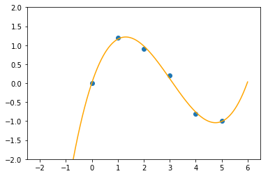

### Draw

其中`xs.pt`，`yx.pt`分别为数据点，拟合图如下。

```python
import torch
import numpy as np
import matplotlib.pyplot as plt

x = torch.load('xs.pt').numpy()
y = torch.load('ys.pt').numpy()

z = np.polyfit(x, y, 3)
p1 = np.poly1d(z)

xs = np.linspace(-1.0, 6.0, 700)
ys = [p1(i) for i in xs]

# set the coordinate range
plt.axis([-2.5, 6.5 ,-2, 2])

plt.scatter(x, y)
plt.plot(xs, ys, 'orange')
plt.show()
```




### Quick start

```python
v = torch.Tensor(list(range(10, 50)))
print(v)
print(v.max())
print(v.min())
```

```
tensor([10., 11., 12., 13., 14., 15., 16., 17., 18., 19., 20., 21., 22., 23.,
        24., 25., 26., 27., 28., 29., 30., 31., 32., 33., 34., 35., 36., 37.,
        38., 39., 40., 41., 42., 43., 44., 45., 46., 47., 48., 49.])
tensor(49.)
tensor(10.)
```


### Convolution implement

```python
# big matrix1
bm1 = torch.Tensor([[0, 0, 0, 0, 0, 0, 0],
                    [0, 1, 0, 1, 2, 1, 0],
                    [0, 0, 2, 1, 0, 1, 0],
                    [0, 1, 1, 0, 2, 0, 0],
                    [0, 2, 2, 1, 1, 0, 0],
                    [0, 2, 0, 1, 2, 0, 0],
                    [0, 0 ,0 ,0 ,0 ,0 ,0]])
# big matrix2
bm2 = torch.Tensor([[0, 0, 0, 0, 0, 0, 0],
                    [0, 2, 0, 2, 1, 1, 0],
                    [0, 0, 1, 0, 0, 2, 0],
                    [0, 1, 0, 0, 2, 1, 0],
                    [0, 1, 1, 2, 1, 0, 0],
                    [0, 1, 0, 1, 1, 1, 0],
                    [0, 0 ,0 ,0 ,0 ,0 ,0]])
# small matrix1
sm1 = torch.Tensor([[1, 0, 1],
                    [-1, 1, 0],
                    [0, -1, 0]])
# small matrix2
sm2 = torch.Tensor([[-1, 0, 1],
                    [0, 0, 1],
                    [1, 1, 1]])

def conv(bm, sm):
    '''
    Calculate the convolution of the matrixes
    bm : the bigger matrix
    sm : the smaller matrix(卷积核)
    '''
    outrow = bm.shape[0] - sm.shape[0] + 1
    outcol = bm.shape[1] - sm.shape[1] + 1
    workout = torch.zeros(outrow, outcol)
    row = sm.shape[0]
    col =  sm.shape[1]
    for i in range(outrow):
        for j in range(outcol):
            workout[i][j] = (bm[i : i + row, j : j + col] * sm).sum()
    return workout
    

# sum the result
print(conv(bm1, sm1) + conv(bm2, sm2))
```

```
tensor([[ 2.,  0.,  2.,  4.,  0.],
        [ 1.,  4.,  4.,  3.,  5.],
        [ 4.,  3.,  5.,  9., -1.],
        [ 3.,  4.,  6.,  2.,  1.],
        [ 5.,  3.,  5.,  1., -2.]])
```

